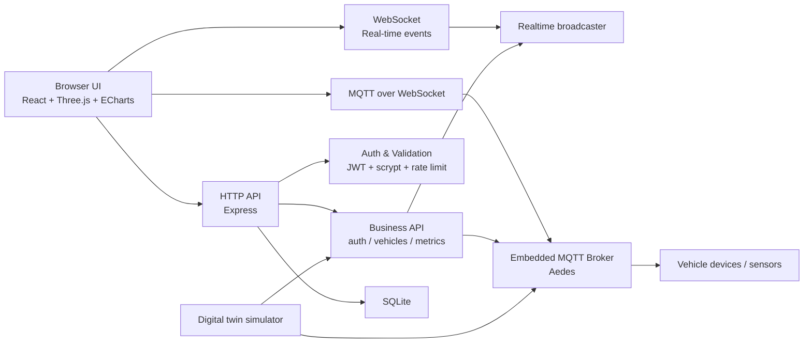

# yuchi-system

`yuchi-system` 是一个面向智能车联调、演示和二次开发的全栈数字孪生平台。它把浏览器 3D 可视化、车辆控制接口、WebSocket 实时推送、MQTT 设备通信和 SQLite 持久化放进同一个工程里，适合做教学演示、实验室平台基线和小规模设备接入验证。

## 项目定位

- 前端：`React + Vite + Three.js + ECharts`
- 后端：`Express + ws + Aedes + SQLite`
- 通信链路：`HTTP API + WebSocket + MQTT over WebSocket`
- 运行方式：支持无设备模拟器联调，也支持接入真实 MQTT 设备

这个项目现在不是单纯的演示 Demo，而是经过一轮安全收紧后的可部署基线：

- 默认关闭公开注册
- 首次启动自动生成运行时密钥
- 前端会话令牌改用 `sessionStorage`
- WebSocket 和 MQTT 都启用鉴权
- MQTT 发布订阅主题有白名单控制
- 接口、消息体和连接数都有限制

## 先看整体架构



图 1：`yuchi-system` 总体架构

## 系统分层

| 层级 | 主要模块 | 作用 |
| --- | --- | --- |
| 前端展示层 | `frontend/src/App.jsx`、`components/*` | 展示车辆、3D 场景、网络指标和事件流 |
| HTTP 接口层 | `backend/api/*.js` | 登录、改密、车辆查询、控制下发、指标读取 |
| 浏览器实时层 | `backend/websocket-server.js` | 把状态变化主动推送给页面 |
| 设备消息层 | `backend/mqtt-broker.js` | 负责设备认证、MQTT 主题权限和消息转发 |
| 存储层 | `backend/database.js`、`backend/data-store.js` | 持久化车辆状态、轨迹、网络指标和用户 |
| 仿真层 | `backend/services/digital-twin.js` | 无真实设备时提供双车编队和网络指标模拟 |
| 安全层 | `auth.js`、`validation.js`、`rate-limit.js` | 统一做 JWT、密码规则、输入校验和限流 |

## 核心特性

- 车辆状态管理：支持查询车辆、更新状态、记录轨迹
- 数字孪生展示：使用 Three.js 显示双车场景和位置变化
- 网络指标监控：支持延迟、丢包、吞吐、RSRP、SINR 可视化
- 实时控制闭环：控制命令会同时进入业务状态、WebSocket 事件和 MQTT 控制主题
- 双实时通道：浏览器走 WebSocket，设备走 MQTT，不混用职责
- 内置模拟器：没有真实设备时也能把前后端和实时链路全部跑通
- 运行时密钥：首次启动自动生成管理员初始密码、JWT 密钥和设备口令

## 目录结构

```text
yuchi-system/
├─ backend/
│  ├─ api/
│  ├─ data/
│  ├─ services/
│  ├─ auth.js
│  ├─ config.js
│  ├─ database.js
│  ├─ mqtt-broker.js
│  ├─ server.js
│  └─ websocket-server.js
├─ docs/
│  ├─ architecture.md
│  ├─ deployment.md
│  ├─ security.md
│  ├─ api.md
│  ├─ troubleshooting.md
│  ├─ csdn_article_yuchi_system.md
│  └─ csdn_article_github_supplement.md
├─ frontend/
│  ├─ src/
│  ├─ package.json
│  └─ vite.config.js
└─ README.md
```

## 运行环境

- Windows、Linux 或其他可运行 Node.js 的环境
- Node.js：建议使用支持 `node:sqlite` 的较新版本
- `npm`
- 浏览器支持 WebSocket 和 ES Module

如果要接真实设备，还需要：

- 能接入 MQTT Broker 的车端或传感器端
- 明确的设备身份口令
- 稳定的 MQTT 主题规范

## 快速启动

### 1. 安装后端依赖

```powershell
cd backend
npm install
```

### 2. 安装前端依赖

```powershell
cd frontend
npm install
```

### 3. 启动后端

```powershell
cd backend
npm start
```

首次启动后，后端会自动创建：

- `backend/data/runtime-secrets.json`
- `backend/data/yuchi.db`

其中 `runtime-secrets.json` 会包含：

- 初始管理员用户名
- 初始管理员密码
- JWT 签名密钥
- MQTT 设备用户名
- MQTT 设备密码

### 4. 启动前端

```powershell
cd frontend
npm run dev
```

开发环境默认访问地址：

- 前端：`http://127.0.0.1:5173`
- 后端：`http://127.0.0.1:3000`

## 默认开发行为

| 项目 | 开发环境默认值 | 说明 |
| --- | --- | --- |
| 公开注册 | 关闭 | 需要显式开启 `ALLOW_REGISTRATION=true` |
| 模拟器 | 开启 | 便于前后端和实时链路联调 |
| CORS | 允许本机 Vite 地址 | 方便本地开发 |
| WebSocket | 走 `Sec-WebSocket-Protocol` 子协议带 token | 避免把 token 暴露在 URL 里 |
| MQTT 页面连接 | 使用 `username + JWT` | 页面不是匿名 MQTT 客户端 |

## 生产部署前必须知道的事

1. 生产环境建议手工提供 `AUTH_TOKEN_SECRET`，不要依赖自动生成。
2. 生产环境默认关闭模拟器，除非你明确要做演示环境。
3. 前后端跨域部署时，必须配置 `CORS_ORIGINS`。
4. `backend/data/runtime-secrets.json` 属于敏感文件，不能公开提交。
5. 真实设备只能使用设备身份接入 MQTT，不能直接复用前端用户口令。

完整部署步骤见：[docs/deployment.md](docs/deployment.md)

## 文档索引

- 架构说明：[docs/architecture.md](docs/architecture.md)
- 安全设计：[docs/security.md](docs/security.md)
- 部署说明：[docs/deployment.md](docs/deployment.md)
- 接口和主题说明：[docs/api.md](docs/api.md)
- 常见问题排查：[docs/troubleshooting.md](docs/troubleshooting.md)
- CSDN 长文版：[docs/csdn_article_yuchi_system.md](docs/csdn_article_yuchi_system.md)
- CSDN 导流补充版：[docs/csdn_article_github_supplement.md](docs/csdn_article_github_supplement.md)

## 适用场景

- 智能车课程设计和实验室展示
- 数字孪生前后端联调
- MQTT 设备接入验证
- 小规模车路协同或车队演示原型
- 作为后续 ROS、视觉识别或边缘计算系统的上层展示与控制基线

## 已知边界

- 当前数据存储使用 SQLite，适合轻量部署，不适合大规模高并发集群
- 当前模拟器主要覆盖双车和网络指标演示，不等同于真实车辆动力学仿真
- 当前 MQTT 权限模型按“应用客户端”和“设备客户端”两类划分，如需更细粒度设备授权，需要继续扩展

## 参考资料

- [Express](https://expressjs.com/)
- [ws](https://github.com/websockets/ws)
- [Aedes](https://github.com/moscajs/aedes)
- [MQTT.js](https://github.com/mqttjs/MQTT.js)
- [React](https://react.dev/)
- [Vite](https://vite.dev/)
- [Three.js](https://threejs.org/docs/)
- [Apache ECharts](https://echarts.apache.org/)
- [SQLite](https://www.sqlite.org/docs.html)
