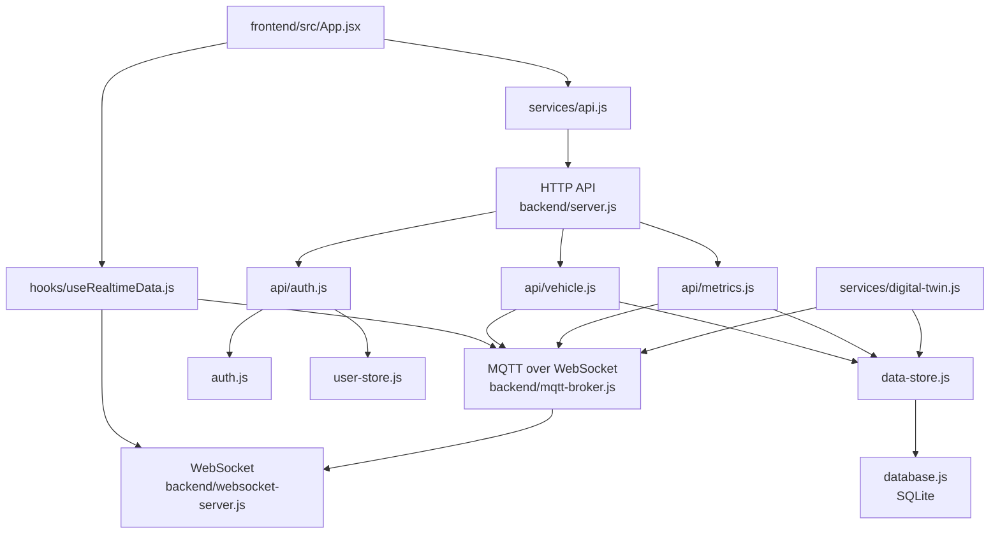

# 架构说明

本文档解决的问题是：`yuchi-system` 到底由哪些模块构成，这些模块之间的数据和控制链路是怎么分工的。

一句话结论：这个系统把“页面请求、浏览器实时推送、设备主题通信、状态持久化、模拟器联调”拆成了五条明确链路，避免把所有实时能力混在一个接口层里。

## 1. 架构总览

图 1：主要模块关系图

## 2. 为什么同时保留 HTTP、WebSocket 和 MQTT

| 链路 | 负责什么 | 为什么不能互相替代 |
| --- | --- | --- |
| HTTP API | 登录、查数据、发控制、改密码 | 适合请求响应，不适合高频主动推送 |
| WebSocket | 给浏览器主动推送状态变化 | 面向页面，不适合做设备主题总线 |
| MQTT | 设备状态上报、控制主题通信 | 面向设备语义，不适合用户认证和初始化页面 |

正确理解方式：

- HTTP 解决“我要什么”
- WebSocket 解决“系统主动告诉我发生了什么”
- MQTT 解决“设备按主题怎么说话”

## 3. 后端模块拆解

| 模块 | 文件 | 职责 |
| --- | --- | --- |
| 启动入口 | `backend/server.js` | 组装 Express、WebSocket、MQTT 和模拟器 |
| 配置中心 | `backend/config.js` | 读取环境变量、生成运行时密钥、设置限流和端口 |
| 鉴权模块 | `backend/auth.js` | JWT 签发校验、密码哈希、接口鉴权 |
| 认证接口 | `backend/api/auth.js` | 注册、登录、获取当前用户、修改密码 |
| 车辆接口 | `backend/api/vehicle.js` | 车辆状态读写、控制命令、轨迹查询 |
| 指标接口 | `backend/api/metrics.js` | 最新指标、历史指标、摘要、上报 |
| MQTT Broker | `backend/mqtt-broker.js` | 设备认证、主题权限、状态转发 |
| WebSocket 服务 | `backend/websocket-server.js` | 浏览器实时连接和广播 |
| 数据层 | `backend/data-store.js`、`backend/database.js` | 业务存储和 SQLite 建表 |
| 用户层 | `backend/user-store.js` | 初始化管理员、轮换历史弱口令 |
| 仿真层 | `backend/services/digital-twin.js` | 双车和网络指标模拟 |

## 4. 前端模块拆解

| 模块 | 文件 | 职责 |
| --- | --- | --- |
| 页面入口 | `frontend/src/App.jsx` | 仪表盘、登录态、控制台、摘要卡片 |
| 鉴权逻辑 | `frontend/src/hooks/useAuth.js` | 登录态恢复、令牌保存、退出 |
| 实时数据 | `frontend/src/hooks/useRealtimeData.js` | HTTP 初始化 + WebSocket + MQTT 联动 |
| API 封装 | `frontend/src/services/api.js` | 统一 REST 调用和 `Authorization` 头 |
| 配置层 | `frontend/src/config.js` | 推导 API、WebSocket、MQTT 地址 |
| 3D 场景 | `frontend/src/components/DigitalTwinScene.jsx` | 车辆和场景渲染 |
| 图表组件 | `NetworkMetricsChart.jsx`、`SignalMetricsChart.jsx` | 网络指标可视化 |

## 5. 关键数据流

### 5.1 页面初始化

1. 用户登录后得到 JWT。
2. 前端通过 `api.getVehicles()` 和 `api.getLatestMetrics()` 拉初始数据。
3. 前端建立 WebSocket 连接。
4. 前端再建立 MQTT over WebSocket 连接并订阅相关主题。
5. 页面同时获得“当前快照”和“后续增量”。

### 5.2 控制命令闭环

1. 用户在前端提交控制命令。
2. HTTP `POST /api/vehicles/:vehicleId/control` 接收命令。
3. 后端校验命令参数。
4. 后端按需要更新车辆业务状态。
5. 后端把控制消息发布到 `yuchi/vehicle/{vehicleId}/control`。
6. 后端通过 WebSocket 把命令事件和车辆状态变化推给页面。

### 5.3 设备状态回流

1. 设备使用 MQTT 设备身份连接 Broker。
2. 设备向 `yuchi/vehicle/{vehicleId}/status` 上报状态。
3. Broker 校验主题和负载。
4. 后端把状态写入 `data-store`。
5. WebSocket 广播给前端。
6. 前端 3D 场景和图表同步刷新。

## 6. 存储模型

| 表名 | 作用 | 关键字段 |
| --- | --- | --- |
| `vehicles` | 当前车辆状态 | 位置、速度、电量、状态、模式 |
| `vehicle_trajectory` | 轨迹历史 | 车辆 ID、时间、位置、速度、朝向 |
| `network_metrics` | 网络指标历史 | 延迟、丢包、吞吐、RSRP、SINR |
| `users` | 用户账号 | 用户名、密码哈希、角色 |

## 7. 这个架构最重要的设计点

| 设计点 | 为什么重要 |
| --- | --- |
| 页面实时和设备实时分开 | 避免浏览器直接变成高权限设备客户端 |
| 配置和运行时密钥分离 | 减少硬编码秘密泄漏风险 |
| 模拟器独立存在 | 没有设备也能做全链路联调 |
| 车辆接口会同步广播和发 MQTT | 保证控制链路是闭环，而不是只改数据库 |
| SQLite + 有界历史 | 对单机和轻量环境更实用，不会无上限膨胀 |

## 8. 适合怎么扩展

| 扩展方向 | 推荐入口 |
| --- | --- |
| 接入真实视觉算法 | `yuchi/perception/yolo`、`yuchi/perception/lane` 主题 |
| 增加新车 | `vehicleId` 规范和 `data-store` 更新逻辑 |
| 增加更细的角色控制 | `auth.js` 与各 API 中间件 |
| 接 ROS 或车载中间件 | 在设备侧作为 MQTT 网关桥接 |
| 替换 SQLite | 先抽离 `database.js` 和 `data-store.js` |

## 9. 最终记忆表

| 你要记住的点 | 结论 |
| --- | --- |
| 页面查数据走什么 | HTTP |
| 页面收实时推送走什么 | WebSocket |
| 设备收发主题走什么 | MQTT |
| 没设备时怎么联调 | 用内置模拟器 |
| 状态放哪里 | SQLite |
| 架构核心原则 | 分链路、分身份、分职责 |
