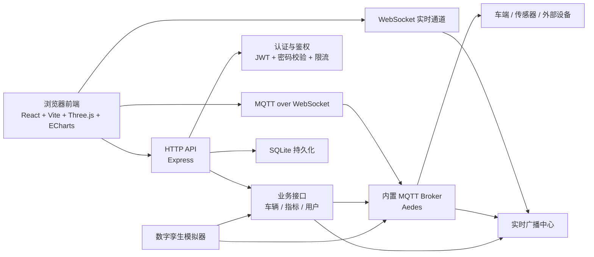

# 从 Demo 到可部署基线：手把手做一个智能车数字孪生与实时控制平台

## 摘要

本文围绕一个完整的智能车数字孪生平台展开，讲清楚前端 3D 可视化、后端控制接口、WebSocket 实时推送、MQTT 设备通信、SQLite 持久化以及安全加固之间是如何协同工作的。文章不仅解释系统为什么这样设计，还给出部署顺序、接口边界、常见踩坑点和上线检查清单。读完之后，你可以建立一个清晰判断：一个“能跑”的智能车平台和一个“能上线”的智能车平台，到底差在哪。

## 源码与文档入口

完整源码、README 和拆分后的部署文档已经整理到 GitHub：

[https://github.com/lelala271/yuchi-system](https://github.com/lelala271/yuchi-system)

如果你只想先跑起来，建议先看仓库里的 `README.md`；如果你准备部署或二次开发，建议继续看 `docs/deployment.md`、`docs/api.md`、`docs/security.md` 和 `docs/troubleshooting.md`。

| 你想找什么 | GitHub 里对应的位置 | 作用 |
|---|---|---|
| 项目总览和快速启动 | `README.md` | 先知道系统是什么、怎么跑起来 |
| 架构关系和数据流 | `docs/architecture.md` | 看清前端、后端、WebSocket、MQTT、SQLite 的关系 |
| 生产部署步骤 | `docs/deployment.md` | 配置 `.env`、关闭模拟器、检查反向代理和实时链路 |
| 安全设计说明 | `docs/security.md` | 理解 JWT、注册开关、MQTT 权限、主题白名单 |
| API 和 MQTT 主题 | `docs/api.md` | 对接前端、设备端或二次开发时查看接口边界 |
| 常见问题排查 | `docs/troubleshooting.md` | 登录、跨域、WebSocket、MQTT、模拟器问题排查 |

这篇 CSDN 文章负责把工程设计讲清楚，GitHub 仓库负责承载完整源码和后续更新。读者如果要复现项目，以 GitHub 中的源码和文档为准。

---

## 1. 这篇文章解决什么问题

很多智能车项目在早期都能很快做出一个可演示版本：

- 前端能看到车辆位置
- 后端能收发控制指令
- MQTT 能把设备消息顶上来
- 页面能画几个实时图表

但一旦准备给别人演示、准备长期维护、或者准备接真实设备，就会立刻暴露一批工程问题：

- 鉴权是不是只是摆设
- WebSocket 和 MQTT 的身份校验是不是统一
- 默认密码、弱口令、公开注册会不会出事故
- 消息主题是不是谁都能发、谁都能订阅
- 页面实时刷新和设备实时上报会不会把系统拖垮
- 本地 demo 能跑，不代表生产环境能扛

**一句话核心结论：**

> 智能车数字孪生平台的难点，不在“把数据画出来”，而在“把控制链路、实时链路、持久化链路和安全边界同时收紧”。  

这篇文章就是围绕这个问题展开。

---

## 2. 先给总览：这个系统到底是什么

先不要急着看代码，先把系统按职责拆开。

### 2.1 系统总目标

这个平台的目标不是单纯做一个前端大屏，而是把下面几类能力统一到一个系统里：

1. 车辆状态展示
2. 数字孪生场景可视化
3. 实时网络指标监控
4. 控制命令下发
5. 设备侧 MQTT 通信
6. 浏览器侧 WebSocket 实时同步
7. 开发阶段模拟器联调
8. 生产环境安全加固

### 2.2 架构总览



图 1：系统总体架构图

### 2.3 按类别拆分模块

| 类别 | 组件 | 作用 | 典型技术 |
|---|---|---|---|
| 前端展示层 | Web 页面、3D 场景、图表 | 展示车辆、网络、检测结果 | React、Three.js、ECharts |
| HTTP 接口层 | REST API | 登录、读写车辆、指标汇总、控制下发 | Express |
| 实时推送层 | WebSocket | 把状态变化主动推送到浏览器 | `ws` |
| 设备消息层 | MQTT Broker | 接设备、传感器、控制消息 | Aedes、MQTT |
| 存储层 | SQLite | 持久化车辆、轨迹、网络指标、用户 | `node:sqlite` |
| 安全层 | JWT、限流、CORS、安全头 | 控制访问边界 | 自定义鉴权 + 中间件 |
| 仿真层 | Digital Twin Simulator | 没有真实设备时提供联调数据 | 定时任务 + 广播 |

这张表很重要，因为很多项目一开始就把“后端”“实时通信”“设备通信”混成一团，最后越改越乱。

---

## 3. 先把容易混淆的概念讲清楚

智能车平台里最容易混淆的，不是代码，而是链路边界。

### 3.1 HTTP、WebSocket、MQTT 不是一回事

| 技术 | 主要用途 | 适合传什么 | 是否双向 | 典型场景 |
|---|---|---|---|---|
| HTTP | 请求-响应 | 配置、登录、查询、一次性控制 | 否 | 登录、获取车辆列表、读取历史数据 |
| WebSocket | 浏览器实时推送 | 实时事件、状态更新、图表刷新 | 是 | 页面实时接收车辆更新、检测事件 |
| MQTT | 设备消息总线 | 设备状态、控制主题、传感器数据 | 是 | 车端上报状态、后端下发控制、设备订阅命令 |

### 3.2 这三条链路在这个系统里的分工

| 链路 | 这个系统里负责什么 | 为什么不能互相代替 |
|---|---|---|
| HTTP API | 登录、注册、修改密码、查车辆、查指标、发控制命令 | 它适合明确请求，不适合高频推送 |
| WebSocket | 浏览器实时收到车辆变化、网络指标、检测结果 | 它面向浏览器，不适合做设备主题总线 |
| MQTT | 设备侧主题通信、控制消息广播、状态上报 | 它适合设备语义，不适合承担用户管理和页面初始化 |

**正确理解方式：**

- HTTP 解决“我要什么”
- WebSocket 解决“系统主动告诉我发生了什么”
- MQTT 解决“设备之间怎么按主题说话”

---

## 4. 项目模块结构怎么理解

从工程上看，这个系统是一个前后端分离项目。

### 4.1 后端模块

后端主要由这些部分组成：

| 模块 | 文件/目录 | 作用 |
|---|---|---|
| 启动入口 | `server.js` | 启动 HTTP、WebSocket、MQTT Broker、模拟器 |
| 配置中心 | `config.js` | 环境变量、运行时密钥、端口、限流、安全开关 |
| 鉴权模块 | `auth.js` | JWT 生成/校验、密码哈希、鉴权中间件 |
| 业务接口 | `api/auth.js` `api/vehicle.js` `api/metrics.js` | 登录、车辆控制、网络指标 |
| MQTT Broker | `mqtt-broker.js` | 设备认证、主题白名单、消息转发 |
| WebSocket | `websocket-server.js` | 页面连接、身份校验、实时广播 |
| 数据存储 | `database.js` `data-store.js` | SQLite 建表、车辆/轨迹/指标存储 |
| 用户管理 | `user-store.js` | 初始化管理员、轮换弱口令、密码更新 |
| 安全辅助 | `http-utils.js` `rate-limit.js` `validation.js` | CORS、安全头、限流、输入校验 |
| 模拟器 | `services/digital-twin.js` | 虚拟两辆车、虚拟网络指标、虚拟感知结果 |

### 4.2 前端模块

前端模块划分也比较清楚：

| 模块 | 文件/目录 | 作用 |
|---|---|---|
| 页面入口 | `src/App.jsx` | 仪表盘总布局、控制台、状态汇总 |
| 3D 场景 | `src/components/DigitalTwinScene.jsx` | 用 Three.js 渲染车辆与场景 |
| 图表 | `NetworkMetricsChart.jsx` `SignalMetricsChart.jsx` | 网络指标可视化 |
| 鉴权逻辑 | `src/hooks/useAuth.js` | 登录态管理、令牌恢复、退出登录 |
| 实时数据 | `src/hooks/useRealtimeData.js` | HTTP 初始化 + WebSocket + MQTT 联动 |
| API 层 | `src/services/api.js` | 封装 REST 调用 |
| 配置层 | `src/config.js` | 动态推导 API/WS/MQTT 地址 |

---

## 5. 后端到底做了什么

这一部分建议你结合代码理解，因为系统“是否可上线”的关键大多在后端。

### 5.1 `server.js` 负责把各个子系统拼起来

后端启动顺序大致是：

1. 创建 Express 应用
2. 注入安全响应头
3. 注入 CORS 和请求体大小限制
4. 对全局 API 限流
5. 对登录/注册额外限流
6. 注册认证、车辆、指标接口
7. 初始化 WebSocket 服务
8. 启动 MQTT Broker
9. 启动 HTTP 服务
10. 初始化管理员账号
11. 按环境决定是否启动模拟器

这个顺序不是随便排的。

原因在于：

- 限流必须在业务接口前面
- 鉴权接口必须先于业务访问被挂载
- WebSocket 和 MQTT 需要共享认证边界
- 模拟器只能在 Broker 和广播链路准备好之后再启动

### 5.2 REST API 的职责边界

#### 认证接口

`/api/auth` 主要负责：

- 注册
- 登录
- 获取当前用户
- 修改密码

这里最值得注意的不是“能登录”，而是它做了三层约束：

1. 用户名格式校验
2. 密码强度校验
3. 公开注册开关控制

也就是说，这不是一个“前端随便传什么都行”的后端。

#### 车辆接口

`/api/vehicles` 主要负责：

- 读车辆列表
- 更新车辆状态
- 下发控制命令
- 查历史轨迹

这里有一个非常重要的工程点：

> 控制命令不是只写数据库，而是同时写业务状态、广播 WebSocket、并发布到 MQTT 控制主题。

这就让系统形成了“控制请求 -> 后端规范化 -> 页面可见 -> 设备可收”的完整闭环。

#### 指标接口

`/api/metrics` 主要负责：

- 获取最新指标
- 获取历史指标
- 获取指标摘要
- 上报网络指标

这让前端既能显示“当前状态”，也能显示“趋势”和“统计”。

---

## 6. 实时链路为什么要同时保留 WebSocket 和 MQTT

很多人第一次做这类系统会问一句：

> 既然 MQTT 已经能实时通信了，为什么还要 WebSocket？

答案是：**它们服务的对象不同。**

### 6.1 WebSocket 是浏览器实时事件层

在这个系统里，WebSocket 主要做三件事：

1. 浏览器建立实时连接
2. 后端把车辆更新、网络指标、检测结果广播给页面
3. 页面用这些事件即时刷新 UI

而且这里做了一个比较关键的安全改动：

- 不再把 token 放在 URL 查询参数里作为主通道
- 优先从 `Sec-WebSocket-Protocol` 子协议里读取 `auth.<token>`

这样做的好处是：

- 避免 token 出现在更容易被记录的 URL 中
- 明确把鉴权和协议协商绑定起来

### 6.2 MQTT 是设备主题总线

在这个系统里，MQTT 主要负责：

- 设备上报车辆状态
- 设备上报网络指标
- 设备上报感知结果
- 后端向设备发布控制命令

而且它没有采用“全匿名 Broker”这种省事但危险的做法，而是分成两类客户端：

| 客户端类型 | 鉴权方式 | 典型对象 |
|---|---|---|
| 应用客户端 | `username + JWT token` | 前端页面 |
| 设备客户端 | `MQTT_DEVICE_USERNAME + MQTT_DEVICE_PASSWORD` | 小车、感知模块、边缘设备 |

### 6.3 为什么还要做主题白名单

如果 MQTT Broker 不做主题约束，就会出现两个典型问题：

1. 浏览器拿到连接后可以随便向设备主题发消息
2. 设备可以订阅或发布本不该接触的主题

这个系统在 Broker 中明确做了：

- 应用客户端只能订阅指定主题集合
- 设备客户端只能发布设备允许的主题模式
- 设备客户端只能订阅车辆控制相关主题
- 禁止写 `$SYS`
- 禁止保留消息
- 限制单条 MQTT 负载大小

这一步非常关键，因为它把“能连上 MQTT”和“能合法操作主题”分开了。

---

## 7. 持久化层为什么不是随便存一下

如果一个平台只有实时画面，没有持久化，那它更像一个临时监视器，而不是工程系统。

### 7.1 SQLite 在这个项目里存了什么

后端使用 `node:sqlite` 建了三类核心表：

| 表名 | 作用 |
|---|---|
| `vehicles` | 当前车辆状态 |
| `vehicle_trajectory` | 车辆轨迹历史 |
| `network_metrics` | 网络指标历史 |
| `users` | 用户账号与密码哈希 |

### 7.2 为什么轨迹和指标都要限长

这类实时系统有个常见坑：

> 不加边界地写轨迹和指标，数据库会越来越大，查询越来越慢。

这个项目在存储层明确做了两类裁剪：

- 单车轨迹最多保留 `300` 条
- 指标总量最多保留 `1000` 条

这不是“功能不全”，而是一个很实用的本地平台优化：

- 演示足够
- 本地部署足够
- 不会无限膨胀

如果以后要上更长期的数据分析，再单独引入时序数据库或消息队列会更合理。

---

## 8. 数字孪生模块到底是不是“只是个 3D 动画”

不是。

### 8.1 数字孪生在这个项目里的实际作用

这里的数字孪生至少承担了三件事：

1. 把车辆状态从抽象数据变成可观察对象
2. 提供控制目标选择入口
3. 让编队、位置、方向变化更直观

前端用 Three.js 做了一个轻量级场景：

- 地面
- 网格
- 车道虚线
- 车辆几何体
- 传感器位置
- 选中高亮

这说明它不是“为了炫酷加个 3D”，而是把控制对象可视化了。

### 8.2 模拟器为什么重要

没有真实车的时候，这类系统很容易卡在联调阶段：

- 前端没数据
- 后端没流量
- MQTT 没消息
- 图表不会动

模拟器的价值就在这里。

这个系统的模拟器会周期性生成：

- 两辆车的编队运动
- 网络时延、丢包、RSRP、SINR、吞吐
- 随机 YOLO 检测结果
- 整体数字孪生快照

这让前端、后端、WebSocket、MQTT 都能在没有真实硬件时一起联调。

---

## 9. 这次安全加固到底改了哪些关键点

这部分是文章的重点，因为很多项目“能跑”和“能上线”的差距，就集中在这里。

### 9.1 先看问题分类

安全问题不要混着讲，先分层。

| 安全层面 | 常见风险 | 这个系统的处理方式 |
|---|---|---|
| 身份认证 | 硬编码密钥、默认弱密码、会话伪造 | 运行时密钥、自动生成管理员密码、自定义 JWT |
| 账号管理 | 任意注册、越权角色创建 | 默认关闭注册、注册角色固定为 `operator` |
| 前端存储 | token 永久落地浏览器 | 从 `localStorage` 收紧到 `sessionStorage` |
| API 访问 | 暴力登录、接口刷爆 | 全局限流 + 认证接口单独限流 |
| 跨域访问 | 任意站点读取接口 | 显式 CORS 白名单 + 同源回退 |
| WebSocket | URL 带 token、任意来源连接 | 子协议携带 token + Origin 校验 |
| MQTT | 匿名接入、任意主题读写 | 强认证 + 发布/订阅主题白名单 |
| 负载攻击 | 超大请求体、超大消息包 | HTTP/WS/MQTT 全部限大小 |
| 浏览器安全 | 点击劫持、MIME 嗅探 | 安全响应头统一下发 |

### 9.2 最关键的几个改造点

#### 改造 1：去掉硬编码密钥

系统不再依赖硬编码 JWT 密钥，而是在首次启动时自动生成运行时密钥并落盘。

好处：

- 代码仓库里不暴露敏感密钥
- 本地开发和生产部署可以自然分离
- 即使忘记手动写 `.env`，系统也不会退化到固定弱密钥

#### 改造 2：初始化管理员账号不再靠固定弱口令

系统会自动生成：

- 初始管理员密码
- MQTT 设备口令

并写入运行时密钥文件。

同时它还做了一件很实用的事：

> 如果数据库里已经存在历史弱口令管理员账号，会在满足条件时自动轮换掉。

这一步比“提醒用户去改密码”更强，因为它主动降低了遗留风险。

#### 改造 3：公开注册默认关闭

很多内部平台一开始为了方便测试，会把注册接口直接开着，结果上线后忘了关。

这个系统反过来做：

- 默认 `ALLOW_REGISTRATION=false`
- 只有显式配置才允许注册

而且即使允许注册，注册出来的角色也是固定 `operator`，不能伪造 `admin`。

#### 改造 4：密码规则真正收紧

密码规则不是“写在前端提示里”，而是后端真校验：

- 长度 `12-128`
- 必须包含大写字母
- 必须包含小写字母
- 必须包含数字
- 必须包含特殊字符

这意味着前端即使被绕过，后端依然能兜住安全边界。

#### 改造 5：WebSocket 和 MQTT 都统一到受控认证

最危险的实时系统往往不是 REST，而是实时链路。

这个项目的处理方式是：

- WebSocket 必须带合法 token
- MQTT WebSocket 连接必须带 `username + JWT`
- 设备端 MQTT 必须带设备专用口令
- 消息主题按客户端类型做权限限制

这样做的意义在于：

> 页面实时展示、页面控制能力、设备真实写入能力，三者不再混为一谈。

---

## 10. 开发和部署应该按什么顺序做

工程项目最怕“顺序错了”，因为顺序错了看起来像哪里都不对。

### 10.1 本地联调顺序

建议按下面顺序走：

1. 启动后端
2. 确认 SQLite 数据库和运行时密钥文件已生成
3. 记录初始管理员账号和密码
4. 启动前端
5. 用管理员账号登录
6. 确认 HTTP、WebSocket、MQTT 状态都连通
7. 确认模拟器是否按预期启用
8. 确认页面上能看到车辆、图表、事件流
9. 发送控制命令验证闭环

### 10.2 启动命令

后端：

```powershell
cd backend
npm install
npm start
```

前端：

```powershell
cd frontend
npm install
npm run dev
```

### 10.3 生产部署顺序

如果准备上线，建议顺序是：

1. 准备后端 `.env`
2. 设置 `NODE_ENV=production`
3. 配置 `CORS_ORIGINS`
4. 设置正式的 `AUTH_TOKEN_SECRET`
5. 设置正式的 MQTT 设备用户名和密码
6. 关闭模拟器 `ENABLE_SIMULATOR=false`
7. 构建前端 `npm run build`
8. 用反向代理统一暴露前端和后端
9. 验证 HTTPS、WebSocket、MQTT WebSocket 地址是否一致

---

## 11. 关键配置项应该怎么理解

这类系统里，很多问题本质上不是代码 bug，而是配置没理解清楚。

### 11.1 后端关键配置表

| 配置项 | 作用 | 典型建议 |
|---|---|---|
| `NODE_ENV` | 区分开发/生产模式 | 生产必须设为 `production` |
| `HTTP_HOST` | HTTP 监听地址 | 生产通常为 `0.0.0.0` |
| `PORT` | HTTP 端口 | 默认 `3000` |
| `CORS_ORIGINS` | 跨域白名单 | 跨域部署时必须显式配置 |
| `AUTH_TOKEN_SECRET` | JWT 签名密钥 | 生产环境务必手工配置 |
| `ALLOW_REGISTRATION` | 是否允许注册 | 内部平台一般关闭 |
| `MQTT_PORT` | MQTT TCP 端口 | 默认 `1883` |
| `MQTT_WS_PORT` | MQTT over WebSocket 端口 | 默认 `8888` |
| `MQTT_DEVICE_USERNAME` | 设备 MQTT 用户名 | 建议使用专用设备身份 |
| `MQTT_DEVICE_PASSWORD` | 设备 MQTT 密码 | 使用强口令 |
| `ENABLE_SIMULATOR` | 是否启用模拟器 | 生产环境关闭 |

### 11.2 前端关键配置表

| 配置项 | 作用 | 什么时候需要改 |
|---|---|---|
| `VITE_API_BASE_URL` | REST API 基地址 | 前后端分离部署时 |
| `VITE_WS_URL` | WebSocket 地址 | 反代、域名或端口变化时 |
| `VITE_MQTT_WS_URL` | MQTT WebSocket 地址 | MQTT 网关地址变化时 |

---

## 12. 常见错误与排查表

这部分非常适合放在 CSDN 文章后半段，读者会直接拿来救火。

| 现象 | 可能原因 | 检查方法 | 解决办法 |
|---|---|---|---|
| 前端能打开但一直提示未登录 | 没有拿到 token 或 token 已失效 | 看浏览器 Network 中 `/auth/login`、`/auth/me` | 重新登录，检查后端 `AUTH_TOKEN_SECRET` 是否变更 |
| WebSocket 一直断开 | token 无效、Origin 不合法、地址不对 | 看浏览器 Console 和网络握手 | 检查 `VITE_WS_URL`、反代配置、登录状态 |
| MQTT 页面状态一直未连接 | MQTT WebSocket 地址错误或鉴权失败 | 看前端日志、后端 Broker 输出 | 检查 `VITE_MQTT_WS_URL`、JWT 是否正常、端口是否暴露 |
| 页面有车但图表不更新 | 指标没有写入或订阅链路没通 | 查 `/metrics/latest`、MQTT `yuchi/network/metrics` | 检查模拟器、设备上报、MQTT 主题 |
| 控制命令发送后设备没反应 | 设备没订阅控制主题或主题权限不匹配 | 看 MQTT 订阅、Broker 日志 | 检查设备是否订阅 `yuchi/vehicle/+/control` |
| 登录总是 429 | 触发认证限流 | 看响应码与 `RateLimit-*` 响应头 | 等待窗口结束，避免暴力重试 |
| 跨域被拒绝 | `CORS_ORIGINS` 没配置或域名不匹配 | 看后端返回是否 `403` | 把前端真实访问域名加入白名单 |
| 生产环境访问正常但 WebSocket/MQTT 不通 | 反向代理没有正确转发升级协议 | 检查 Nginx/网关配置 | 开启 `Upgrade` / `Connection` 转发 |

---

## 13. 这个项目最值得借鉴的工程经验

如果你不是单纯想复刻这个项目，而是想提炼方法，建议重点看这几条。

### 13.1 先把链路分层，再写业务

不是“先把所有东西做出来”，而是先明确：

- 哪些是配置
- 哪些是认证
- 哪些是页面实时链路
- 哪些是设备实时链路
- 哪些是数据库状态

这一点决定后面会不会越改越乱。

### 13.2 模拟器不是玩具，而是开发基础设施

智能车项目最难的是联调，而不是单个模块开发。

没有模拟器，前端、后端、实时链路、设备协议就很难并行推进。

### 13.3 安全不要等“最后上线前”再补

像下面这些问题，如果一开始不管，后面会越来越痛：

- 固定弱密码
- 开放注册
- MQTT 匿名
- WebSocket URL 带 token
- 没有主题白名单
- 没有限流

这些都不是“上线前顺手改一下”就能自然补好的。

### 13.4 不要把“能实时通信”和“有权限通信”混为一谈

实时系统真正危险的地方，恰恰是“它很方便”。

方便意味着：

- 页面容易直接拿到控制能力
- 设备容易直接拿到系统总线
- 测试阶段留下的宽松配置容易流入生产

所以必须把：

- 身份认证
- 消息主题权限
- 接口限流
- 数据大小限制

放到系统设计里，而不是只靠使用规范。

---

## 14. 源码、GitHub 文档和这篇文章怎么配合

由于 CSDN 一次只适合发布一篇完整文章，正文里必须把系统背景、架构、链路、安全、部署、排错都讲完整；但完整源码、配置模板和后续维护不能只靠文章承载，所以 GitHub 仓库是这个项目的主工程入口。

### 14.1 为什么不能只靠一篇文章

智能车数字孪生项目不是单文件示例，而是“前端 + 后端 + 实时通信 + 设备协议 + 配置 + 文档”的组合体。

| 内容 | 放在 CSDN 的作用 | 放在 GitHub 的作用 |
|---|---|---|
| 架构设计 | 帮读者理解系统为什么这样拆 | 长期保留结构化说明 |
| 完整源码 | 文章里不适合全文粘贴 | 读者可直接克隆和运行 |
| 环境变量模板 | 文章解释关键项 | 仓库保留可复制模板 |
| API 和 MQTT 主题 | 文章讲核心边界 | 仓库保留完整接口说明 |
| 排错清单 | 文章给常见问题 | 仓库方便后续持续补充 |

### 14.2 GitHub 仓库里已经整理好的内容

完整仓库地址：

[https://github.com/lelala271/yuchi-system](https://github.com/lelala271/yuchi-system)

仓库里的文档可以按下面顺序读：

| 顺序 | 文档 | 适合什么时候看 |
|---|---|---|
| 1 | `README.md` | 第一次打开仓库，先看项目是什么、怎么启动 |
| 2 | `docs/architecture.md` | 想理解前后端、WebSocket、MQTT、SQLite 怎么协作 |
| 3 | `docs/deployment.md` | 准备本地部署、生产部署或写交付说明 |
| 4 | `docs/security.md` | 想确认默认密码、注册开关、实时链路权限是否安全 |
| 5 | `docs/api.md` | 想接真实设备、写前端功能、对接 MQTT 主题 |
| 6 | `docs/troubleshooting.md` | 登录失败、跨域失败、WebSocket 或 MQTT 不通时排查 |

### 14.3 真正复现项目时建议怎么走

如果你是第一次接触这个项目，不建议一上来就改代码。推荐按这个顺序：

1. 先读本文，理解 HTTP、WebSocket、MQTT 三条链路的分工。
2. 打开 GitHub 仓库，看 `README.md` 的快速启动。
3. 启动后端，确认 `runtime-secrets.json` 和 SQLite 数据库生成。
4. 启动前端，用初始管理员账号登录。
5. 确认模拟器数据、车辆位置、图表、事件流都正常。
6. 再看 `docs/api.md`，决定真实设备应该上报哪些 MQTT 主题。
7. 准备上线前，再按 `docs/deployment.md` 和 `docs/security.md` 检查配置。

### 14.4 最容易忽略的几个文件

| 文件或配置 | 为什么重要 |
|---|---|
| `backend/data/runtime-secrets.json` | 首次启动后的管理员密码、JWT 密钥和设备口令都和它有关 |
| `backend/.env.example` | 生产部署时后端配置应以它为模板 |
| `frontend/.env.example` | 前后端分离部署时，前端 API、WebSocket、MQTT 地址从这里配置 |
| `ALLOW_REGISTRATION` | 默认关闭注册，不是注册功能坏了 |
| `ENABLE_SIMULATOR` | 本地演示可开启，真实部署要谨慎关闭 |
| `VITE_MQTT_WS_URL` | 页面 MQTT 连接失败时，经常是这个地址没有配对 |

### 14.5 文章和仓库的最终分工

| 发布位置 | 承载内容 |
|---|---|
| CSDN 本文 | 系统讲解、架构拆解、安全设计、部署顺序、排错方法 |
| GitHub 仓库 | 完整源码、配置模板、README、专项文档、后续更新 |

一句话记住：

> CSDN 负责把项目讲明白，GitHub 负责把工程交完整。

---

## 15. 最后给一个记忆表

这是整篇文章最适合收藏的部分。

### 15.1 一张表记住系统核心

| 维度 | 这个项目怎么做 | 为什么这样做 |
|---|---|---|
| 页面展示 | React + Three.js + ECharts | 同时兼顾 3D、图表、控制台 |
| 业务接口 | Express REST API | 处理登录、查询、控制、汇总 |
| 浏览器实时 | WebSocket | 主动推送状态变化 |
| 设备实时 | MQTT Broker | 设备主题通信更自然 |
| 持久化 | SQLite | 本地部署简单、足够轻量 |
| 联调方式 | 内置模拟器 | 没设备也能跑完整闭环 |
| 鉴权 | JWT + 密码强度 + 角色控制 | 收紧页面和接口访问边界 |
| 实时安全 | WebSocket 校验 + MQTT 强认证 + 主题白名单 | 防止实时通道失控 |
| 稳定性 | 请求体/消息体限制 + 限流 | 降低滥用和误操作风险 |
| 上线策略 | 生产关闭模拟器、显式配置 CORS 和密钥 | 把 demo 与生产隔离开 |

### 15.2 一句话复习

> 一个可靠的智能车数字孪生平台，核心不是“前端做得多炫”，而是“控制、通信、存储、安全四条链路能不能同时收拢”。  

---

## 16. 参考资料

1. [Express 官方文档](https://expressjs.com/)
2. [ws WebSocket 库](https://github.com/websockets/ws)
3. [MQTT.js 官方仓库](https://github.com/mqttjs/MQTT.js)
4. [Aedes MQTT Broker](https://github.com/moscajs/aedes)
5. [Vite 官方文档](https://vite.dev/)
6. [React 官方文档](https://react.dev/)
7. [Three.js 官方文档](https://threejs.org/docs/)
8. [Apache ECharts 官方文档](https://echarts.apache.org/)
9. [SQLite 官方文档](https://www.sqlite.org/docs.html)

---

## 17. 发布前自检清单

发 CSDN 之前，建议按下面这份清单再过一遍：

1. 是否已经把本地私有路径替换成公开路径表达
2. 是否去掉了敏感文件名和真实密钥内容
3. 是否明确区分了 HTTP、WebSocket、MQTT 三条链路
4. 是否说明了模拟器和真实设备的边界
5. 是否给出了部署顺序而不是只贴命令
6. 是否把安全改造写成了“原因 + 做法 + 结果”
7. 是否给出了排错表和最终记忆表
8. 是否在开头给出 GitHub 源码入口
9. 是否说明 GitHub 中 README、部署文档、接口文档和排错文档的位置

如果这些内容都满足，这篇文章就不只是“项目介绍”，而是一篇真正有工程价值、能把读者带到完整源码的开发文章。
